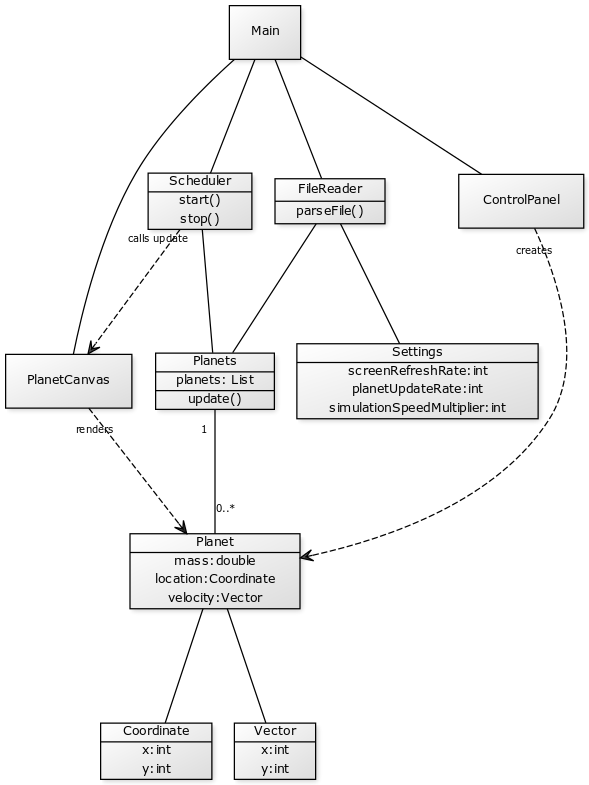

#### Subject
  Stardust is a program that aims to simulate the movement and force between planets as accurately as possible in a 2D plane.
  
#### Functionality
  Basic functionality will include adding and removing planets, changing simulation speed, zooming in and out and moving the camera around.

